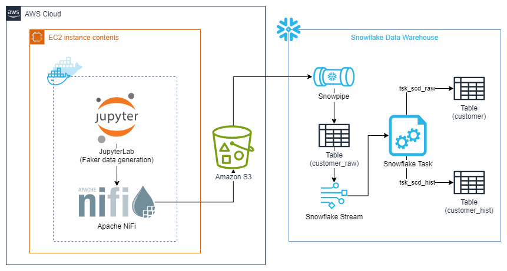
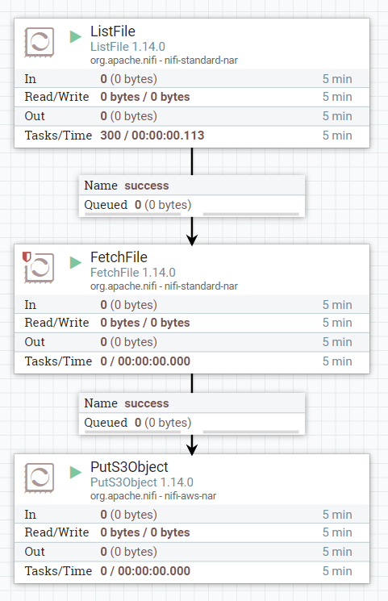

# realtime-data-streaming

## Services
- Apache NiFi: an integrated data logistics platform for automating the movement of data between disparate systems.
- Amazzon S3: Simple Storage Service is a service offered by Amazon Web Services that provides object storage through a web service interface.
- Snowflake: a cloud-based data warehousing solution that provides a highly scalable and flexible platform for storing and processing data.

## Architecture Diagram

## Apache NiFi pipeline

